# Zama Confidential Locker


<div align="center">

[](https://nextjs.org/)
[](https://www.typescriptlang.org/)
[](https://soliditylang.org/)
[](https://hardhat.org/)
[](https://zama.ai/)

</div>

## 📖 Overview

**Zama Confidential Locker** is a privacy-preserving DeFi application built on the **Zama Devnet**. It leverages **Fully Homomorphic Encryption (FHE)** to enable confidential token locking and vesting.

Unlike traditional lockers where amounts and unlock times are public, Zama Confidential Locker ensures that sensitive financial data remains encrypted on-chain, visible only to the owner and authorized parties.

## 🏗️ Architecture

### Confidential Deposit Flow

```mermaid
%%{init: {'theme':'dark', 'themeVariables': { 'primaryColor':'#00c2ff', 'primaryTextColor':'#fff', 'primaryBorderColor':'#00a7d7', 'lineColor':'#00c2ff', 'secondaryColor':'#ff6b6b', 'tertiaryColor':'#3700b3', 'background':'#111', 'mainBkg':'#1b1b1b', 'secondBkg':'#242424', 'labelBackground':'#242424', 'labelTextColor':'#fff', 'actorBkg':'#2f2f2f', 'actorBorder':'#00c2ff', 'actorTextColor':'#fff', 'signalColor':'#00c2ff', 'signalTextColor':'#fff'}}}%%
sequenceDiagram
    participant User as User
    participant Frontend as Frontend
    participant FHE as Zama FHEVM
    participant Contract as ConfidentialLocker
    participant Registry as ComplianceRegistry

    rect rgb(30,60,80)
        Note over User,Contract: PHASE 1 · Encryption & Deposit
        User->>Frontend: Input Amount, Time, KPI
        Frontend->>FHE: Encrypt(Amount, Time, KPI)
        FHE-->>Frontend: Encrypted Handles + Proofs
        Frontend->>Contract: lock(encryptedArgs, proofs)
    end

    rect rgb(50,80,60)
        Note over Contract,Registry: PHASE 2 · Verification & Storage
        Contract->>Registry: isAllowed(User)
        Registry-->>Contract: true
        Contract->>FHE: Verify Proofs
        Contract->>Contract: Store Encrypted Lock
        Contract-->>User: Mint LockerPass NFT
    end
```



### Conditional Withdrawal Flow


## ✨ Key Features

-   **🔒 Confidential Deposits**: Lock tokens without revealing the amount to the public.
-   **⏱️ Encrypted Vesting**: Unlock times are encrypted, preventing front-running and speculation based on unlock schedules.
-   **🛡️ Compliance Integration**: Built-in compliance registry to ensure only authorized users can participate.
-   **⚡ FHE Powered**: Utilizes `fhevm` for on-chain computation over encrypted data.

## 🛠️ Tech Stack

-   **Frontend**: Next.js, Tailwind CSS, `fhevmjs`, `wagmi`
-   **Smart Contracts**: Solidity, `fhevm` library
-   **Development Environment**: Hardhat, Zama Devnet

## 🚀 Deployed Contracts

| Contract | Address | Network |
| :--- | :--- | :--- |
| `LockerPass` | *Pending Deployment* | Zama Devnet |
| `ComplianceRegistry` | *Pending Deployment* | Zama Devnet |
| `ConfidentialLocker` | *Pending Deployment* | Zama Devnet |
| `ConfidentialBuyback` | *Pending Deployment* | Zama Devnet |

## 📦 Getting Started

### Prerequisites

-   Node.js >= 20
-   Metamask (or other Web3 wallet)

### Installation

1.  Clone the repository:
    ```bash
    git clone https://github.com/yourusername/compliant-fhe-mixer.git
    cd compliant-fhe-mixer
    ```

2.  Install dependencies:
    ```bash
    npm install
    cd frontend && npm install
    ```

3.  Run the frontend:
    ```bash
    cd frontend
    npm run dev
    ```

## 📜 License

This project is licensed under the MIT License.
